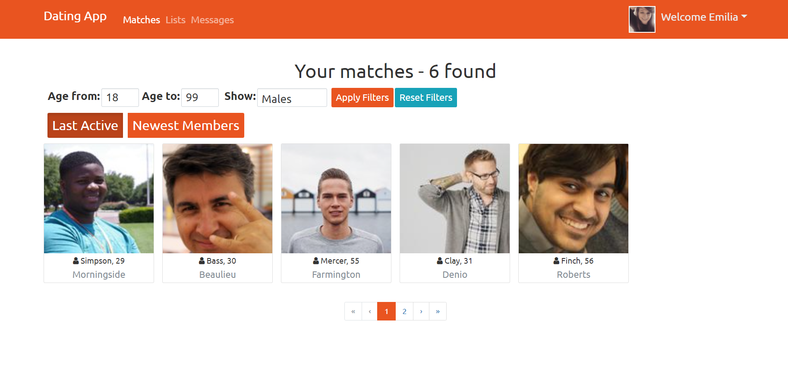

# Dating App
> An application which allows you to find a suitable romantic partner written in C#, typescript, html and some CSS for styling. 
>
> Dating App was created using .NET and Angular frameworks.
>
> All data is stored in SQLite database (using Entity Framework).
>
> _Live demo will be added_ [_here_](https://youtu.be/oxzEdm29JLw). 

## Table of Contents
* [Goals](#Goals)
* [Features](#features)
* [Screenshots](#screenshots)
* [Setup](#setup)
* [Project Status](#project-status)
* [Room for Improvement](#room-for-improvement)
* [Acknowledgements](#acknowledgements)


## Goals
- The project was created for the purpose of learning technologies used for developing mobile apps and to practice programming skills. I honestly think I learned a lot while making it.


## Features
- Live chatting and liking other users
- Adding your own photos (hosting via Cloudinary)
- Register and login features
- Multiple roles to have (admin, moderator, user) with different possibilities


## Screenshots



## Setup
- You have to have .NET 5.0.12 SDK, Git, Angular 11.2.6 and recent Node package manager installed on your computer
- You have to create your Cloudinary account
- You have to clone this repo using _git clone https://github.com/Tomekxm/DatingApp.git_
- You have to configure your CloudinarySettings in API/appsettings.json (pattern below)
```json 
{
    "CloudinarySettings":{
        "CloudName":"xxxxxxx",
        "ApiKey":"xxxxxxxxxxxxxx",
        "ApiSecret":"xxxxxxxxxxxxxx"
    }
}
```
- Then go to the DatingApp directory in your Visual Studio Code (that's software I used, feel free to use the other one) terminal and use following commands:
```bash 
cd API
dotnet restore
dotnet run
```
- Then open new terminal and use following commands: 
```
cd client
npm install
ng serve
```


## Project Status
Project is: _almost complete_


## Room for Improvement
Room for improvement:
- Increase the responsiveness of the website

To do:
- Upgrade to .NET 6 and Angular 13
- Photo approval system
- Live demo


## Acknowledgements
- This project was based on [this tutorial](https://www.udemy.com/course/build-an-app-with-aspnet-core-and-angular-from-scratch/). A great course and I can recommend it to anyone who wants to learn how to develop web applications.

